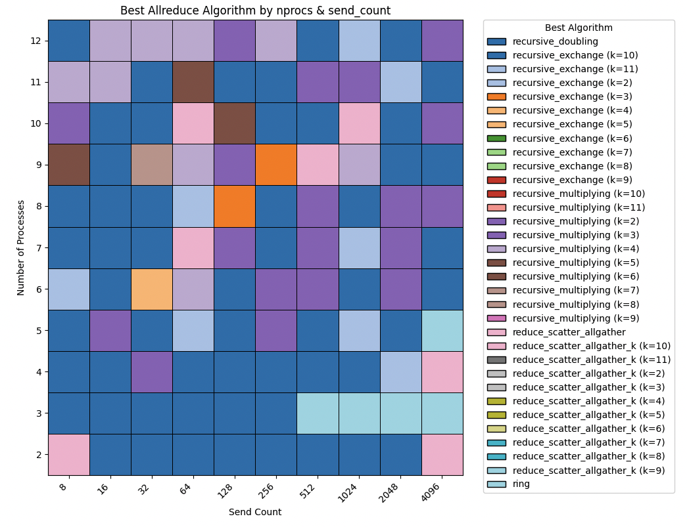

# MPICH Allreduce Benchmark

MPICH Allreduce implementations for direct testing and a simple benchmark harness to compare their performance. Each implementation lives in its own `.cpp` file, with an embedded test‐driver under `#ifdef DEBUG_MODE`. A top‐level `Makefile` automates building the full benchmark or debugging a single algorithm.

---

## Table of Contents

1. [Repository Structure](#repository-structure)  
2. [Prerequisites](#prerequisites)  
3. [Building](#building)  
4. [Running the Full Benchmark](#running-the-full-benchmark)
5. [Python Plotting Script](#python-plotting-script) 
6. [Debugging a Single Implementation](#debugging-a-single-implementation)  
7. [Makefile Targets & Parameters](#makefile-targets--parameters)  
8. [Examples](#examples)  
9. [License](#license)  

---

## Repository Structure

```
.
├── allreduce_k_reduce_scatter_allgather.cpp
├── allreduce_recursive_doubling.cpp
├── allreduce_recursive_multiplying.cpp
├── allreduce_reduce_scatter_allgather.cpp
├── allreduce_ring.cpp
├── allreduce_inter_reduce_exchange_bcast.cpp
├── allreduce_recexch.cpp
├── common.hpp
├── main.cpp
├── Makefile         
├── plots/
│   ├── plotter.py          # Python plotting script
│   └── images/
│       └── example.png       # Example output of plot_results.py
└── README.md
```

- **allreduce_*.cpp**  
  MPICH Allreduce algorithms. Each contains:
  - A function `MPICH_Allreduce_<name>(…)` implementing the algorithm.
  - A `main()` under `#ifdef DEBUG_MODE` to test correctness.
- **common.hpp**  
  Shared utilities, type definitions, and helper macros.
- **main.cpp**  
  Top-level driver that loops over all implementations, times each, and writes results in a csv file.
- **Makefile**  
  Automates build, full benchmark run, single‐algorithm debug build & run.
- **README.md**  
  This document.

---

## Prerequisites

- A POSIX‐compatible shell (bash, zsh, etc.)  
- [OpenMPI](https://www.open-mpi.org/) or MPICH installed, with `mpicc`/`mpicxx` & `mpirun` in your `$PATH`  
- A C++ compiler supporting C++11  
- `make`

---

## Building

Clone or download the repository, then in the top‐level directory:

```bash
make
```

This will compile `main.cpp` and all `allreduce_*.cpp` into object files, then link the `benchmark` executable.

---

## Running the Full Benchmark

By default, the benchmark will launch `RANKS_PER_NODE × NUM_NODES = 3 × 3 = 9` MPI processes and run each algorithm 50 times with number of elements = 8^i for i = 0 to 10, writing results to `results.csv`, NOTE: for parametrized algorithms, e.g. `allreduce_k_reduce_scatter_algather.cpp`, the benchmark will run it for every k from 2 to nprocs - 1. :

```bash
make run-benchmark            # append mode (default)
make run-benchmark OVERWRITE=1  # truncate and overwrite results.csv
```

You can override:

```bash
make run-benchmark RANKS_PER_NODE=4 NUM_NODES=2
```
---
## Python Plotting Script
After running the benchmark, you can use the `plotter.py` script to generate plots from the results. The script reads the `results.csv` file and generates a plot that shows which algorithm is the fastest for each number of elements and number of processes.

Example output:
<div style="text-align: center;">
  
</div>

X-axis: send_count (number of elements)
Y-axis: nprocs (total MPI ranks)
Each colored square shows the algorithm with the lowest median time for that combination.


## Debugging a Single Implementation

Each `.cpp` contains its own `main()` when compiled with `-DDEBUG_MODE`. Use the `debug-<impl>` target to compile and immediately run one algorithm:

```bash
make debug-allreduce_ring
```

This will:

1. Compile `allreduce_ring.cpp` with `-g -DDEBUG_MODE`  
2. Launch `mpirun -np RANKS_PER_NODE×NUM_NODES ./debug-allreduce_ring`

Override defaults:

```bash
make debug-allreduce_recursive_doubling RANKS_PER_NODE=2 NUM_NODES=1
```

---

## Makefile Targets & Parameters

| Target               | Description                                                                                  |
|----------------------|----------------------------------------------------------------------------------------------|
| `all` (default)      | Build the full `benchmark` executable.                                                       |
| `run-benchmark`      | Run `benchmark` under MPI, 10 elements each.                                                 |
| `debug-<impl>`       | Build & run a single implementation in debug mode.                                           |
| `clean`              | Remove `benchmark`, `debug-*`, `.o` files, and `results.csv`.                                |
| `help`               | Show usage and list of implementations.                                                      |

| Parameter           | Default | Description                                           |
|---------------------|---------|-------------------------------------------------------|
| `RANKS_PER_NODE`    | `3`     | Number of MPI ranks per node                         |
| `NUM_NODES`         | `3`     | Number of MPI nodes                                   |
| `DEBUG`             | `0`     | If `1`, compiles full‐benchmark with debug symbols     |
| `OVERWRITE`             | `0`     | If `1`, bench driver truncates results.csv; if `0`, it appends  |

---

## Examples

- Build & run full benchmark with 12 processes (4 per node, 3 nodes), TRUNCATING CSV:
  ```bash
  make run-benchmark RANKS_PER_NODE=4 NUM_NODES=3 OVERWRITE=1
  ```
- Build full benchmark with debug symbols (no single‐impl debug):
  ```bash
  make DEBUG=1
  ```
- Debug the recursive-doubling implementation on 2 processes:
  ```bash
  make debug-allreduce_recursive_doubling RANKS_PER_NODE=2 NUM_NODES=1
  ```
- Clean up all generated files:
  ```bash
  make clean
  ```

---

## License
Copyright © 2025 Valentino Guerrini, Ke Fan, Sidharth Kumar
This project is released under the MIT License. See [LICENSE](LICENSE) for details.
"""
