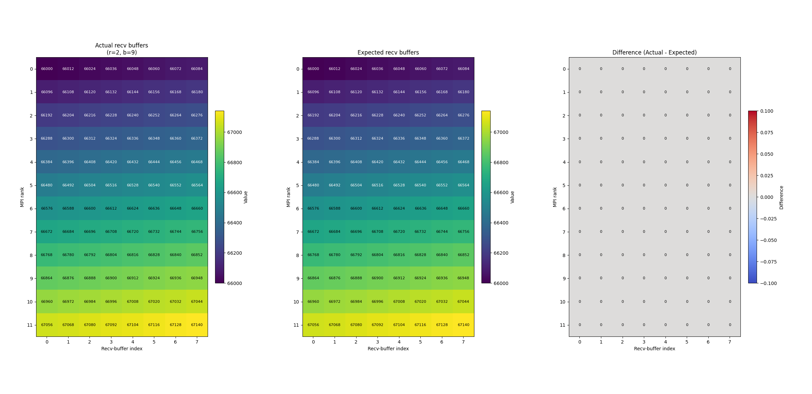

# README

This folder contains a C++ implementation of `reduce_scatter_radix_block` and accompanying scripts to verify its correctness and visualize results.

## Files

- **reduce_scatter_beta1.cpp**: C++ source implementing `reduce_scatter_radix_block` plus a testing `main()` that:
  1. Builds per-rank send buffers in a recognizable pattern.
  2. Calls `reduce_scatter_radix_block` with arguments `(r, b)`.
  3. Gathers both initial send-buffers and final receive-buffers at rank 0 and writes them to `all_buffers.txt`.

- **visualize_buffers.py**: Python script that reads `all_buffers.txt`, extracts send/recv data, and displays heatmaps for visual inspection.

- **Makefile**: Automates compilation, execution, and visualization:
  - `make`: Compiles `reduce_scatter_beta1.cpp` into `reduce_scatter` (suppresses VLA warnings).
  - `make run [NP=<procs>] [R=<r>] [B=<b>]`: Runs the MPI executable with `NP` processes and parameters `r`, `b`, generating `all_buffers.txt`.
  - `make visualize`: Launches `visualize_buffers.py` on `all_buffers.txt` to show initial send and final receive buffers.
  - `make full [NP=<procs>] [R=<r>] [B=<b>]`: Runs `make`, then `make run`, then `make visualize` in sequence.
  - `make clean`: Removes the compiled executable and `all_buffers.txt`.
  - `make help`: Prints usage information.

## Usage

1. **Build**
   ```bash
   make
   ```
   Compiles `reduce_scatter_beta1.cpp` into the MPI executable `reduce_scatter`.

2. **Run**
   ```bash
   make run
   ```
   - By default: `NP=4`, `R=2`, `B=7`.
   - Overrides:
     ```bash
     make run NP=8 R=3 B=5
     ```
   After completion, `all_buffers.txt` will contain both initial send buffers and final receive buffers from all ranks.

3. **Visualize**
   ```bash
   make visualize
   ```
   Opens a matplotlib window showing three side-by-side heatmaps:
   - Expected receive buffers (rows = MPI ranks, columns = buffer indices)
   - Final receive buffers (rows = MPI ranks, columns = buffer indices)
   - Difference between expected and actual receive buffers (rows = MPI ranks, columns = buffer indices)
   
   Example output:
<div style="text-align: center;">
  
</div>


4. **Full Pipeline**
   ```bash
   make full
   ```
   Combines build, run, and visualize in one step. You can also override defaults:
   ```bash
   make full NP=8 R=3 B=5
   ```

5. **Clean**
   ```bash
   make clean
   ```
   Deletes the `reduce_scatter` executable and `all_buffers.txt`.

6. **Help**
   ```bash
   make help
   ```
   Prints a summary of available Makefile targets and variables.

## Correctness Check

- The testing `main()` stamps each send buffer element as `rank * 1000 + index`, ensuring that after an `MPI_SUM`+scatter, the expected value for rank `i`, position `k` is:
  ```text
  expected[i][k] = 1000 * sum_{r=0..P-1} r + P * (i * count + k)
                  = 1000 * (P*(P-1)/2) + P * (i*count + k)
  ```
- You can visually inspect the heatmaps to quickly spot any discrepancies.  A separate script `check_and_visualize_recv.py` (not included here) can be used to automatically compare actual vs. expected values and highlight mismatches.

## Requirements

- **MPI** (e.g., OpenMPI or MPICH) with `mpicxx` available in `PATH`.
- **Python 3** with `numpy` and `matplotlib` installed.

